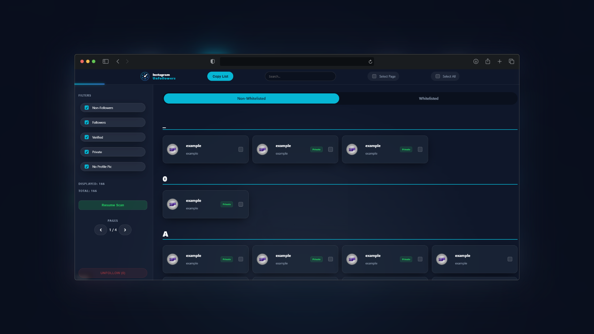
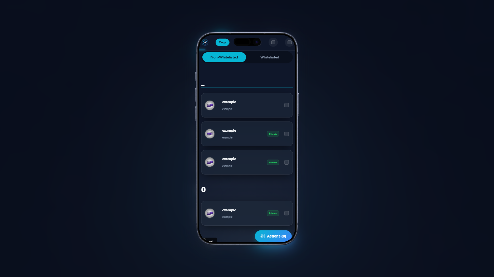
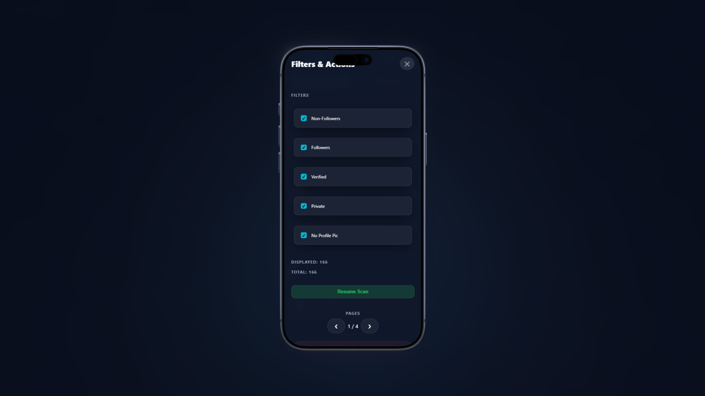

# 👁️ Instagram Unfollowers 2026 - Safe & Modern Script

[](https://github.com/edvincodes/InstagramUnfollowers)
[](LICENSE)
[](https://preactjs.com/)
[](https://www.instagram.com/)
[](https://github.com/edvincodes/InstagramUnfollowers/releases)

[🇺🇸 English](#-english-version) | [🇪🇸 Español](#-versión-en-español)

---

<div id="english"></div>

## 🇺🇸 English Version

**The safest, most advanced tool to manage your Instagram community.**
Unlike other tools that steal your password, this script runs locally in your browser using **Shadow DOM** for maximum safety.

> **🚀 v4.0.0 "Time Machine" Update:** Now featuring **Persistent History**, **Analytics Dashboard**, **CSV Export**, and **Mutuals Detection**.

### ✨ New in v4.0 (The Big Update)

- **🕰️ Time Machine (History):** The app now **remembers**. It automatically detects _new_ unfollowers since your last scan and logs them in a chronological timeline.
- **📊 Analytics Dashboard:** See how many traitors you've caught and how many users you've cleaned over time.
- **🤝 Mutuals Tab:** Easily filter people who **follow you back** (Friends) vs. those who don't (Traitors).
- **📥 Export to CSV:** Download your full follower report to Excel/Numbers for safekeeping.
- **🛡️ Smart Whitelist:** Protect your friends with a single click.

### 💎 Why choose this?

- **🛡️ 100% Safe & Private:** Runs locally. **No password required.** Your data (including history) stays on your machine.
- **🤖 Anti-Ban System:** "Human-like" delays and cooling periods to prevent Instagram blocks.
- **📱 Mobile App Experience:** Features a responsive design with swipeable tabs and touch-optimized controls for iOS/Android.
- **⚡ Modern Tech:** Built with Preact, TypeScript, and local IndexedDB.

### 🚀 How to Use (Desktop)

1.  **Get the Code:** Go to the [Official Tool Page](https://edvincodes.github.io/InstagramUnfollowers/) or copy from `dist/dist.js`.
2.  **Copy:** Click "Copy Code to Clipboard".
3.  **Login:** Open [instagram.com](https://www.instagram.com).
4.  **Console:** Press `F12` (Windows) or `Cmd+Opt+J` (Mac).
5.  **Run:** Paste the code and hit Enter.

### 📱 How to Use (Mobile - iOS/Android)

1.  Copy the code from the [Tool Page](https://edvincodes.github.io/InstagramUnfollowers/).
2.  Create a new Browser Bookmark named "IG Scan".
3.  Edit the bookmark and paste the code in the URL field.
4.  Open Instagram, type "IG Scan" in the address bar, and tap the bookmark.

---

<div id="spanish"></div>

## 🇪🇸 Versión en Español

**La herramienta más avanzada y segura para gestionar tu comunidad en Instagram.**
A diferencia de apps que roban tu contraseña, este script se ejecuta localmente en tu navegador usando **Shadow DOM**.

> **🚀 Actualización v4.0.0 "Máquina del Tiempo":** Ahora con **Historial Persistente**, **Panel de Estadísticas**, **Exportación CSV** y **Detección de Mutuals**.

### ✨ Novedades de la v4.0

- **🕰️ Máquina del Tiempo (Historial):** La app ahora **tiene memoria**. Detecta automáticamente a los _nuevos_ seguidores que te han dejado de seguir desde el último escaneo.
- **📊 Panel de Estadísticas:** Visualiza cuántos "traidores" has detectado y a cuántos has dejado de seguir a lo largo del tiempo.
- **🤝 Pestaña de Mutuals:** Filtra fácilmente a la gente que **sí te sigue** (Amigos) de la que no (Traidores).
- **📥 Exportar a CSV:** Descarga un informe completo en Excel para tener una copia de seguridad de tus datos.
- **🛡️ Whitelist Inteligente:** Protege a tus amigos con un solo clic.

### 💎 ¿Por qué elegir esto?

- **🛡️ 100% Seguro y Privado:** Se ejecuta en tu navegador. **No pide contraseña.** Tus datos (incluido el historial) nunca salen de tu PC.
- **🤖 Sistema Anti-Ban:** Tiempos de espera "humanos" y periodos de enfriamiento para evitar bloqueos.
- **📱 Experiencia Móvil:** Diseño adaptativo con pestañas deslizables y controles táctiles optimizados para Android/iPhone.
- **⚡ Tecnología Moderna:** Construido con Preact, TypeScript y base de datos local.

### 🚀 Cómo usar (PC)

1.  **Consigue el código:** Ve a la [Página Oficial](https://edvincodes.github.io/InstagramUnfollowers/).
2.  **Copia:** Pulsa el botón de copiar.
3.  **Instagram:** Abre [instagram.com](https://www.instagram.com) e inicia sesión.
4.  **Consola:** Presiona `F12` (Windows) o `Cmd+Opt+J` (Mac).
5.  **Ejecutar:** Pega el código en la consola y pulsa Enter.

---

## 📸 Screenshots / Capturas

<p align="center">
  
</p>

<details>
  <summary><b>👀 Click to see New Features (History & Mobile)</b></summary>
  
  <br>

### 🕰️ History & Stats (New in v4.0)

_See exactly when users unfollowed you._

  <p align="center">
    
  </p>

### 📱 Mobile Experience

_Fully responsive interface with drawer menu._

  <p align="center">
    
    
  </p>
</details>

---

## ⚙️ Configuration & Safety / Seguridad

To prevent Instagram from flagging your account ("Action Blocked"), we include a **Safe Mode**.

- **Scan Interval:** Speed of checking followers.
- **Unfollow Interval:** Delay between actions (Crucial for safety).
- **Cooldowns:** Auto-pause after 5-10 unfollows.
- **Data Persistence:** History is stored in your browser's LocalStorage. Clearing browser data will reset your history.

> **⚠️ WARNING:** Using aggressive settings may lead to temporary restrictions. Use the default "Safe Mode".

---

## 🛠️ Local Development

Want to contribute?

```bash
git clone https://github.com/edvincodes/InstagramUnfollowers.git
cd InstagramUnfollowers
npm install
npm run build
```

---

## ⚖️ Disclaimer & Legal

**English:**
This tool is an independent project and is not affiliated, associated, authorized, endorsed by, or officially connected with Instagram or Meta Platforms, Inc.

- **Use at your own risk.** The author is not responsible for any account restrictions resulting from the misuse of this tool.
- This tool does not collect any personal data. Everything runs locally on your machine.

**Español:**
Esta herramienta es un proyecto independiente y no está afiliada, asociada, autorizada ni conectada oficialmente con Instagram o Meta Platforms, Inc.

- **Úsala bajo tu propia responsabilidad.** El autor no se hace responsable de restricciones en la cuenta derivadas del mal uso de esta herramienta.
- Esta herramienta no recolecta datos personales. Todo se ejecuta localmente en tu equipo.

---

## ❤️ Credits

Developed with ❤️ by **Edvin**.

Licensed under the [MIT License](https://www.google.com/search?q=LICENSE).
